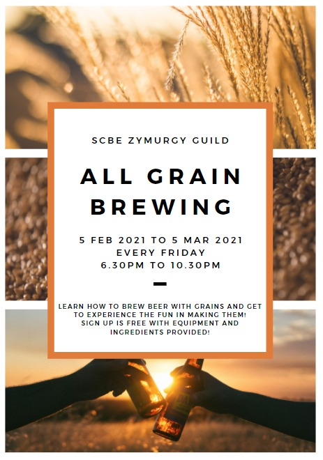
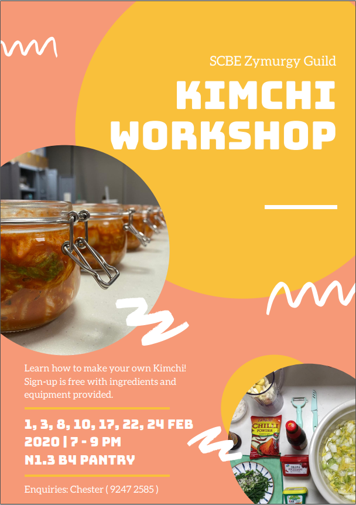
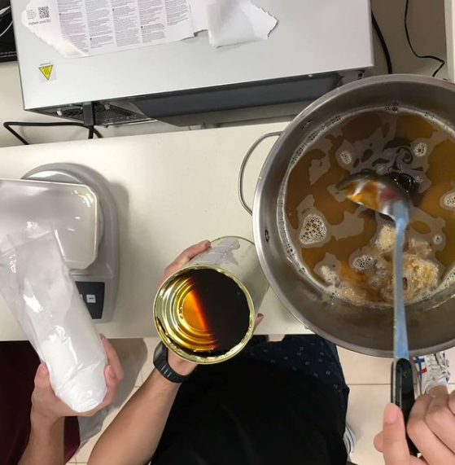

## Welcome to SCBE Zymurgy Guild

This website will be used to share our activities and to provide links with useful information for all! For example, recipes, workshop slots and more!

### Upcoming Workshops

Our upcoming workshops, click on the poster to book slots!

### Homebrewing Links

Here are some links that will be useful for homebrewing:

[Homebrewing Basics](http://www.howtobrew.com/)

[ABV Calculator](https://www.vinolab.hr/calculator/gravity-density-sugar-conversions-en19)

[Hops Flavour](https://byo.com/resource/hops/)

[Hops Style Guide](http://www.hopslist.com/style-guide/)

### Kimchi Recipe

[Kimchi Recipe](https://www.koreanbapsang.com/baechu-kimchi-napa-cabbage-kimchi/)

### [Gallery](./Gallery.html)

Some of the photos taken during our workshops and other miscellaneous activites!

For more pics/videos, check out our instagram at: [Zymurgy Guild Instagram](https://www.instagram.com/scbe_zymurgyguild/)

